# Toronto_Rental_ML
## Checkout the Application [Toronto Rentals](https://etlinsightapi3.herokuapp.com/static/html/team.html)
## Project Intro/Objective 

This project is a continuation of the [Toronto_Rental_Insight project](https://github.com/bnarath/Toronto_Rental_Insight), which involved scrapping Toronto rental posting data on a daily basis and creating an interactive dashboard to make it available to users to explore. 
By building on the Toronto_Rental_Insight project, the current project will achieve the following objectives:
*	Optimize the map function to improve usability.
*	Create a webpage with an interactive dashboard enabling users to benchmark rental costs, crime rates, and community service availability. 
*	Further develop app functionality by incorporating machine learning. 
* Deploy the machine learning model to provide insight to the users regarding the fair price.

## Project Architecture

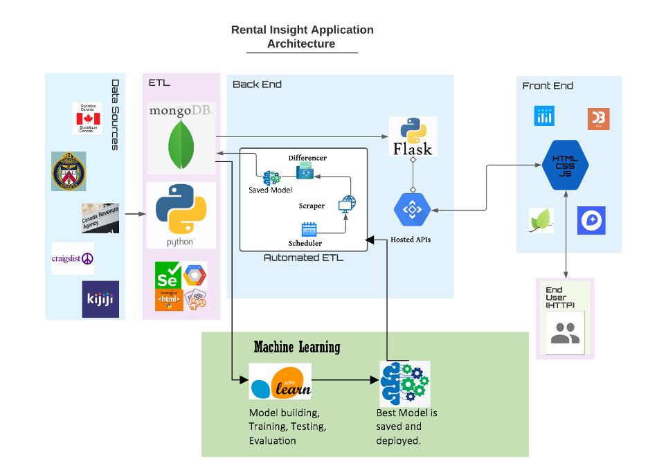

## Approach
### Optimization of maps
* The code will be revisited to improve the performance of the map.  Solutions include reducing the number of times each dataset must be read. 
Tools: JavaScript, Python
### Create dedicate insight webpage
* In the prior iteration of the app, neighbourhood insights were embedded in the map function. In the current iteration, the insights will be located on a dedicated dashboard. 
* The dashboard will include rental cost trends, crime stats and community services information. 
* Users will be able choose which areas they would like to compare.
Tools: JavaScript, Python, d3. 
### Machine learning 

### Problem 1: Predicting fair rental price based on rental features
* Goal: To be able to show users both the actual price of a rental and the fair rental price predicted by our model based on the features of the apartment such as the number of rooms, the crime rate in the neighbourhood etc. 

* Approach:
  - Transformations
    - Convert nonstandard nulls (white spaces, None, etc. ) to NaNs to be able to treat them equally
    - FSA and rental_type are taken as mandatory entries as the missing value imputation doesn't make much sense (or would mislead) here
    - furnished is decoded into 3 categories - 'YES', 'NO', 'NOT_MENTIONED'
    - Typecasting (price -> int, post_published_date -> date)
    - Derived features
      - 'image' -> Atleast one image is in post or not ? Boolean
      - 'posted_week_of_month' -> Derived from post_published_date
    - One hot encoding of all categorical variables
  - Feature Reduction - Using Recursive Feature Elimination (RFE)
    - RFE is a wrapper function that recursively eliminates unimportant features
    - RFE needs a model and the number of features
    - XGB is used as the model for RFE
    - Different number of features are tried and validated based on 5-Fold validation
    - Derived 35 as the optimal number of features
    
    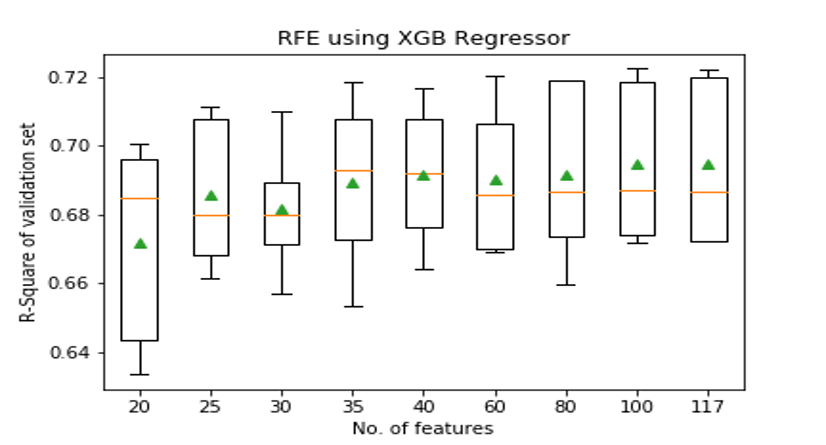
    
    ```diff
    Selected Features
    ['sqft', 'bedrooms', 'bathrooms', 'image_False', 'FSA_M1B', 'FSA_M1M',
       'FSA_M1P', 'FSA_M1V', 'FSA_M1W', 'FSA_M2M', 'FSA_M3C', 'FSA_M3K',
       'FSA_M4E', 'FSA_M4V', 'FSA_M4W', 'FSA_M5G', 'FSA_M5J', 'FSA_M5R',
       'FSA_M5S', 'FSA_M5V', 'FSA_M6B', 'FSA_M6E', 'FSA_M6G', 'FSA_M6J',
       'FSA_M6K', 'FSA_M6M', 'FSA_M6P', 'rental_type_apartment',
       'rental_type_condo', 'rental_type_house', 'rental_type_loft',
       'rental_type_townhouse', 'furnished_NOT', 'furnished_YES',
       'pet_friendly_False']
    ```
* Algorithms: Various algorithms are trained with the selected features. Each of the algorithms are fine tuned using gridsearch CV to find the optimal parameters.
  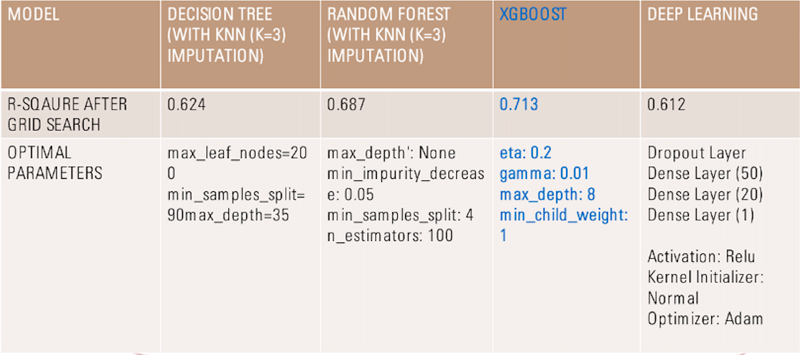

* Model Selection: XGBoost model is choosen as it is providing higher R-square. This model is integrated to the scheduler and made available in the front end.

* Feature Ranking(Explainability): XGB gives feature importance as follows.
  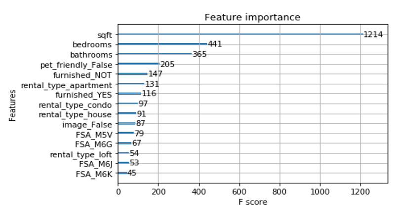

## Application Features
* Available Rentals - This map shows all the latest rental listings available on Craigslist.
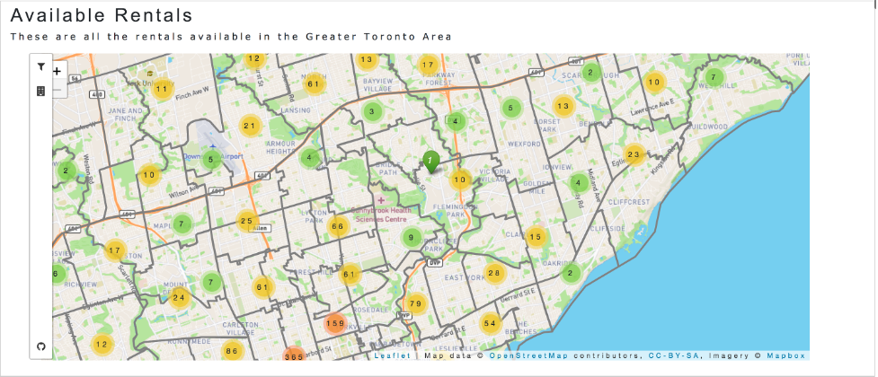
* Available Rentals Filter - Enables users to filter listings by number of bedrooms, bathrooms and price range when the filter icon is clicked.
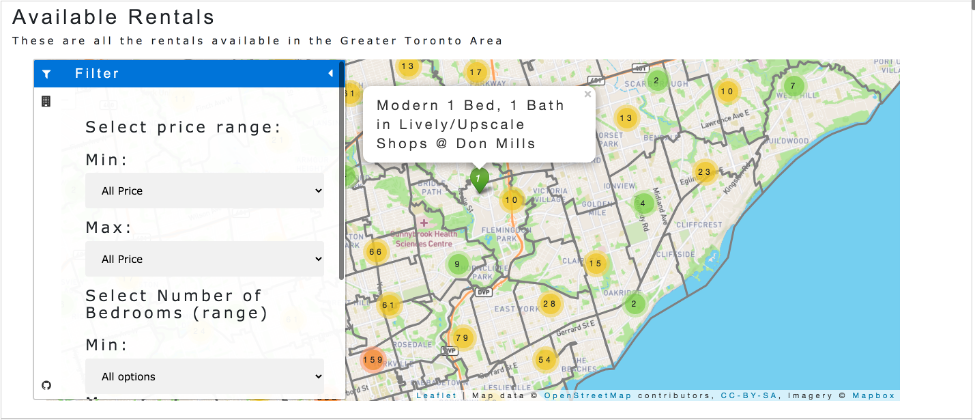
* Available Rental Information - Enables users to view rental details in the sidebar when a rental is clicked in the map.
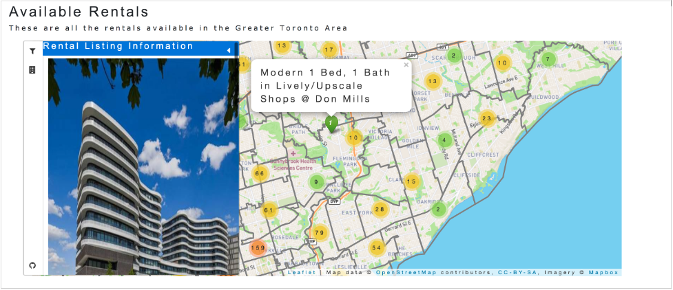

* Crime Rate - Allows users to view the crime rate near the location of the rental listing selected in the previous map. 
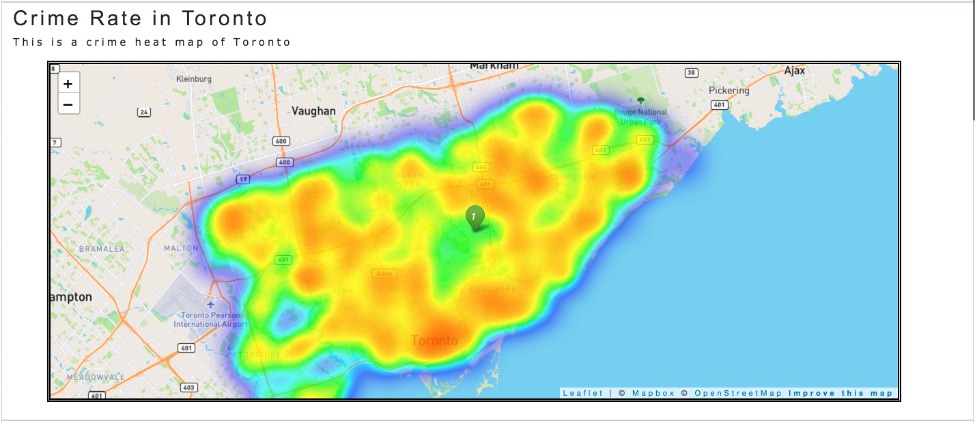

* Community Services - Allows users to view the Community Services available near the loaction of the rental listing selected in the previous map.
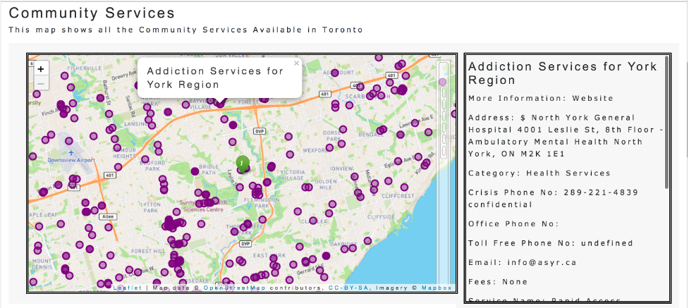
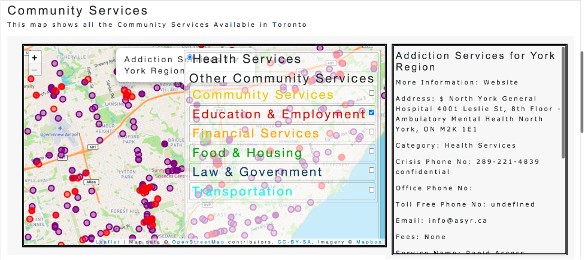

* Income Distribution - Allows users to view the average income rate in each FSA and near the rental listing selected.
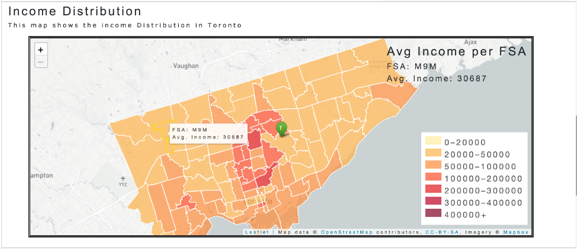

* Age Distribution - Allows users to view the average age in each FSA and near the rental listing selected.
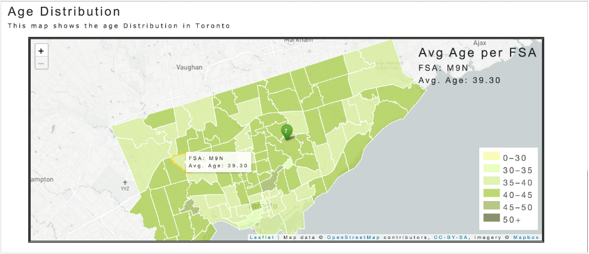


## Insights - Driver of Rental Prices
* Square-footage has the highest importance among the features incorporated in the model predicting fair market price. Though there would appear to be a linear relationship between square-footage and price, square-footage on its own is a weak predictor (r-square value of 0.41). 
* Though average prices increase with increasing number of bedrooms, the number of bedrooms alone is a weak predictor of rental price (r-square value of 0.29). 
Similarly, though average prices increase with increasing number of bathrooms (up to 2.5 bathrooms) the number of bedrooms alone is a weak predictor of rental price (r-square value of 0.36). 
* Interestingly, how rentals are described in regards to type appears to impact price. Whereas apartment, suites, flats and condos could describe the same rental opportunities, condos are more expensive on average.  

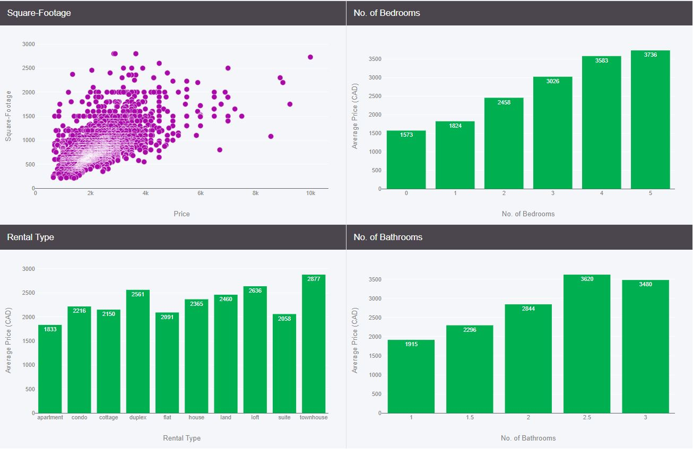

## Future Work

### Problem 1: Predicting fair rental price based on rental features
* Create new features
* Improve accuracy
### Problem 2: Clustering rentals to discover interesting patterns and create a recommendation system
### Problem 3: Using NLP to recommend rentals based on user's description of their dream living space  
* Key word searching
