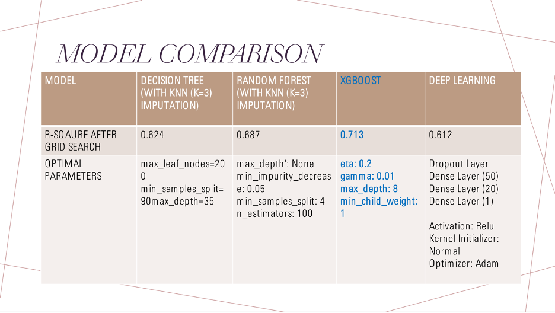

# Toronto_Rental_ML
## Project Intro/Objective

This project is a continuation of the [Toronto_Rental_Insight project](https://github.com/bnarath/Toronto_Rental_Insight), which involved scrapping Toronto rental posting data on a daily basis and creating an interactive dashboard to make it available to users to explore. 
By building on the Toronto_Rental_Insight project, the current project will achieve the following objectives:
*	Optimize the map function to improve usability.
*	Create a webpage with an interactive dashboard enabling users to benchmark rental costs, crime rates, and community service availability. 
*	Further develop app functionality by incorporating machine learning. 

## Project Architecture


## Approach
### Optimize map function
* The code will be revisited to improve the performance of the map.  Solutions include reducing the number of times each dataset must be read. 
  - After code refactoring, performance is improved significantly.
    - Leaflet extensions are used to store relevant data in markers to use them for various purposes.
    - Single Map is replotted to numerous maps to avoid clutter and to enhance the user experience.
    - New maps are added to produce complete insights for users.
    - **Tools: JavaScript, Python**
### Create dedicate insight webpage
* In the prior iteration of the app, neighbourhood insights were embedded in the map function. In the current iteration, the insights will be located on a dedicated dashboard. 
* The dashboard will include rental cost trends, crime stats and community services information. 
* Users will be able choose which areas they would like to compare.
Tools: JavaScript, Python, d3. 
### Machine learning 

### Problem 1: Predicting fair rental price based on rental features
* Goal: To be able to show users both the actual price of a rental and the estimated rental price predicted by our model based on the features of the apartment such as the number of rooms, the crime rate in the neighbourhood etc. to get a sense of the price as fair, overpriced, just right etc.

* Approach:
  - Transformations
    - Convert nonstandard nulls (white spaces, None, etc. ) to NaNs to be able to treat them equally
    - FSA and rental_type are taken as mandatory entries as the missing value imputation doesn't make much sense (or would mislead) here
    - furnished is decoded into 3 categories - 'YES', 'NO', 'NOT_MENTIONED'
    - Typecasting (price -> int, post_published_date -> date)
    - Derived features
      - 'image' -> Atleast one image is in post or not ? Boolean
      - 'posted_week_of_month' -> Derived from post_published_date
    - One hot encoding of all categorical variables
  - Feature Reduction - Using Recursive Feature Elimination (RFE)
    - RFE is a wrapper function that recursively eliminates unimportant features
    - RFE needs a model and the number of features
    - XGB is used as the model for RFE
    - Different number of features are tried and validated based on 5-Fold validation
    - Derived 35 as the optimal number of features
    
    
    ```diff
    Selected Features
    ['sqft', 'bedrooms', 'bathrooms', 'image_False', 'FSA_M1B', 'FSA_M1M',
       'FSA_M1P', 'FSA_M1V', 'FSA_M1W', 'FSA_M2M', 'FSA_M3C', 'FSA_M3K',
       'FSA_M4E', 'FSA_M4V', 'FSA_M4W', 'FSA_M5G', 'FSA_M5J', 'FSA_M5R',
       'FSA_M5S', 'FSA_M5V', 'FSA_M6B', 'FSA_M6E', 'FSA_M6G', 'FSA_M6J',
       'FSA_M6K', 'FSA_M6M', 'FSA_M6P', 'rental_type_apartment',
       'rental_type_condo', 'rental_type_house', 'rental_type_loft',
       'rental_type_townhouse', 'furnished_NOT', 'furnished_YES',
       'pet_friendly_False']
    ```
    
* Algorithms: Various algorithms are trained with the selected features. Each of the algorithms are fine tuned using gridsearch CV to find the optimal parameters.
  

* Model Selection: XGBoost model is choosen as it is providing higher R-square. This model is integrated to the scheduler and made available in the front end.

* Feature Ranking(Explainability): XGB gives feature importance as follows.


### Problem 2: Clustering rentals to discover interesting patterns 
* Goal: To be able to cluster rentals based on all the features available and analyze the data to discover correlation between different parameters such as weather or not certain types of crime are related to a lack of availabilty of community services. 
* Algorithm: K-means Clustering
* Methodology
### Problem 3 (future scope): Using NLP to recommend rentals based on user's description of their dream living space  
* Goal: To be able to take a natural input description from the user and find a rental with similar features and rental description. 
* Algorithm: Neural Networks
