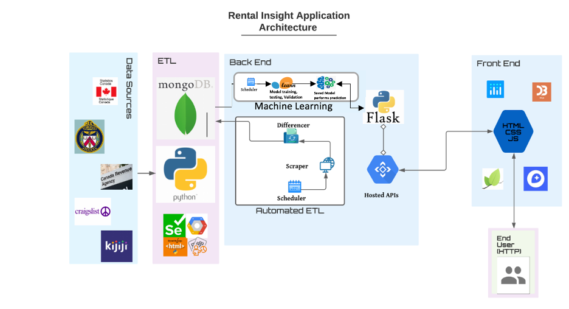

# Toronto_Rental_ML
## Project Intro/Objective

This project is a continuation of the [Toronto_Rental_Insight project](https://github.com/bnarath/Toronto_Rental_Insight), which involved scrapping Toronto rental posting data on a daily basis and creating an interactive dashboard to make it available to users to explore. 
By building on the Toronto_Rental_Insight project, the current project will achieve the following objectives:
*	Optimize the map function to improve usability.
*	Create a webpage with an interactive dashboard enabling users to benchmark rental costs, crime rates, and community service availability. 
*	Further develop app functionality by incorporating machine learning. 

## Project Architecture

## Approach
### Optimize map function
* The code will be revisited to improve the performance of the map.  Solutions include reducing the number of times each dataset must be read. 
Tools: JavaScript, Python
### Create dedicate insight webpage
* In the prior iteration of the app, neighbourhood insights were embedded in the map function. In the current iteration, the insights will be located on a dedicated dashboard. 
* The dashboard will include rental cost trends, crime stats and community services information. 
* Users will be able choose which areas they would like to compare.
Tools: JavaScript, Python, d3. 
### Machine learning 

### Problem 1: Predicting fair rental price based on rental features
* Goal: To be able to show users both the actual price of a rental and the fair rental price predicted by our model based on the features of the apartment such as the number of rooms, the crime rate in the neighbourhood etc. 
* Algorithm: Linear Regression 
* Methodology: Train a Linear Regression Model on existing data and get a moderately high accuracy. Apply this model to existing and new incoming rentals.
### Problem 2: Clustering rentals to discover interesting patterns 
* Goal: To be able to cluster rentals based on all the features available and analyze the data to discover correlation between different parameters such as weather or not certain types of crime are related to a lack of availabilty of community services. 
* Algorithm: K-means Clustering
* Methodology
### Problem 3: Using NLP to recommend rentals based on user's description of their dream living space  
* Goal: To be able to take a natural input description from the user and find a rental with similar features and rental description. 
* Algorithm: Neural Networks

## Insights - Driver of Rental Prices
* Square-footage has the highest importance among the features incorporated in the model predicting fair market price. Though there would appear to be a linear relationship between square-footage and price, square-footage on its own is a weak predictor (r-square value of 0.41). 
* Though average prices increase with increasing number of bedrooms, the number of bedrooms alone is a weak predictor of rental price (r-square value of 0.29). 
Similarly, though average prices increase with increasing number of bathrooms (up to 2.5 bathrooms) the number of bedrooms alone is a weak predictor of rental price (r-square value of 0.36). 
* Interestingly, how rentals are described in regards to type appears to impact price. Whereas apartment, suites, flats and condos could describe the same rental opportunities, condos are more expensive on average.  

